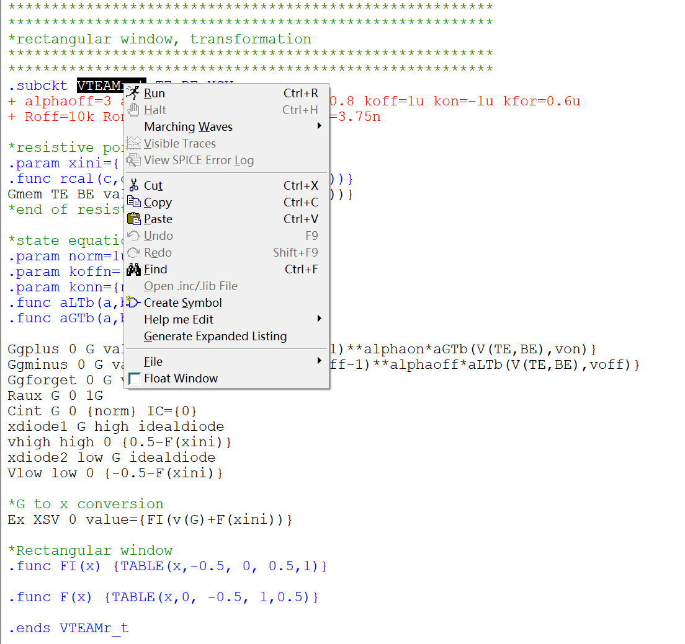
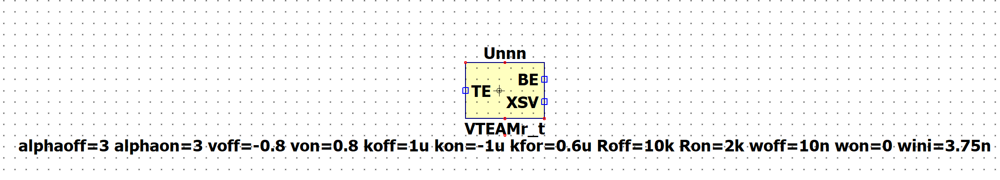
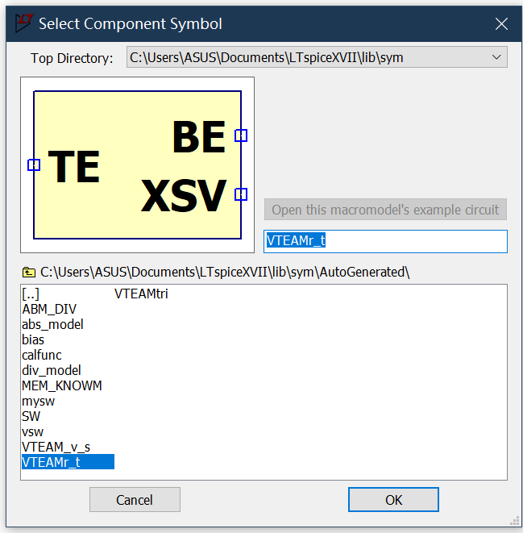
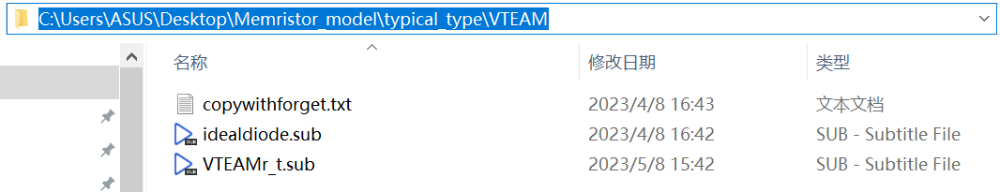
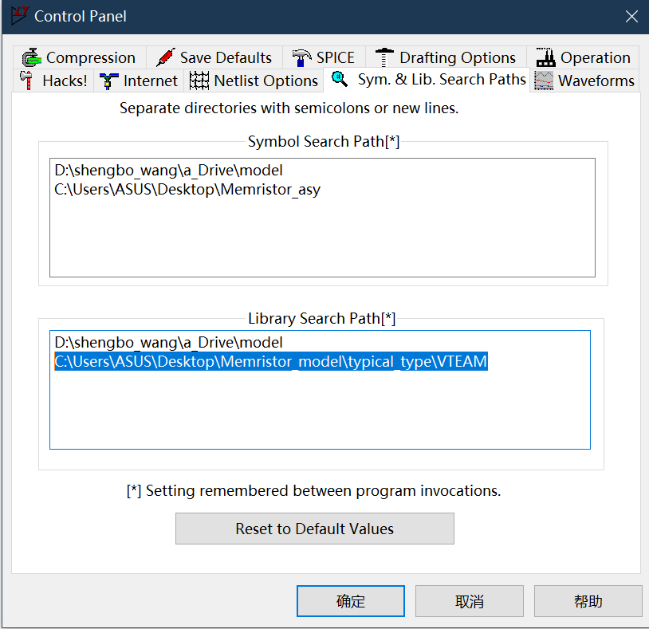
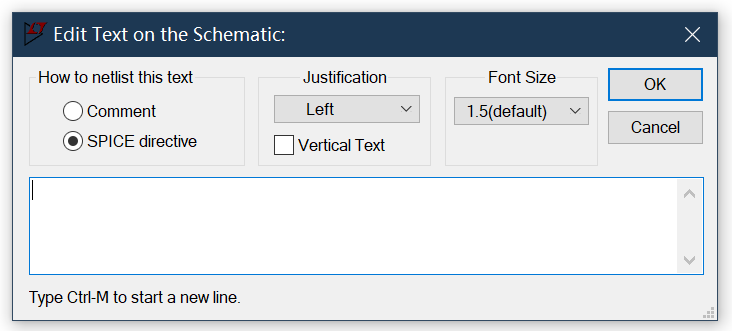

# How to build and use neuromorphic device in SPICE simulation
A neuromorphic device is not a typical electronic device that can be found in SPICE components, so the neuromorphic device can be considered as a third-party model for SPICE. VTEAMr_t.sub is the memristor SPICE model, and the article can be found using the following link.[VTEAM model](https://ieeexplore.ieee.org/stamp/stamp.jsp?tp=&arnumber=9354151) idealdiode is an ideal diode model.

## How to import the neuromorphic device model
- Open the VTEAMr_t.sub file, right-click the line containing the name of the subcircuit, and select Create Symbol.
{:height="50%" width="50%"}
- Edit the symbol if needed and save.
{:height="50%" width="50%"}
- Select the neuromorphic device (memristor) model and place it in the schematic.
{:height="50%" width="50%"}
- Add the model search path (Please change the path based on where these model files are stored on your computer).
{:height="50%" width="50%"}
{:height="50%" width="50%"}
- Add the idealdiode link in the schematic (Please change the path based on where these model files are stored on your computer).
{:height="50%" width="50%"}
{:height="50%" width="50%"}